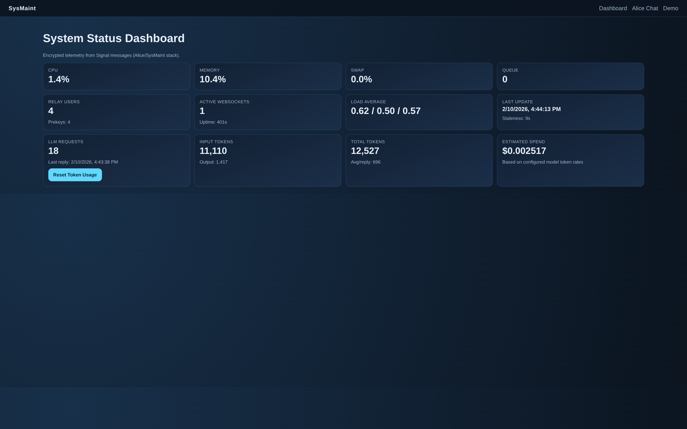
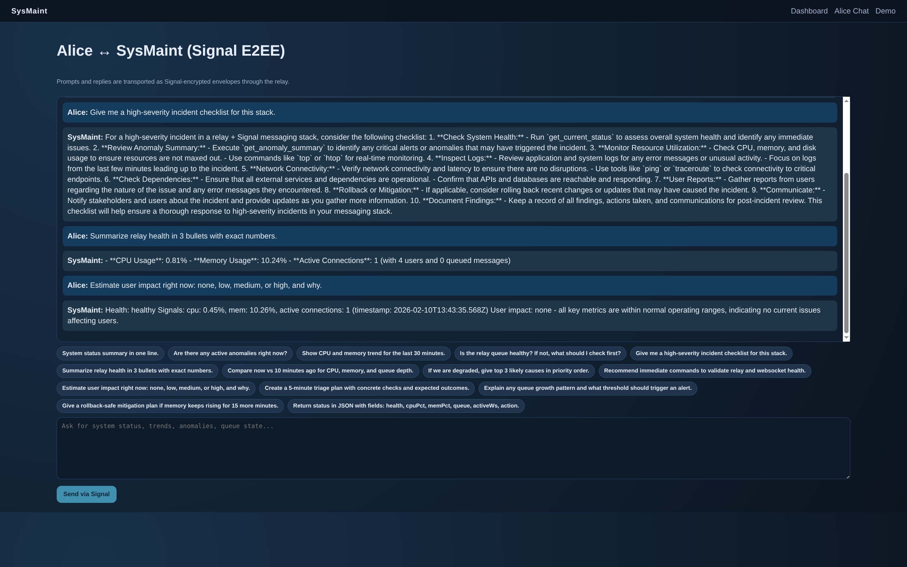
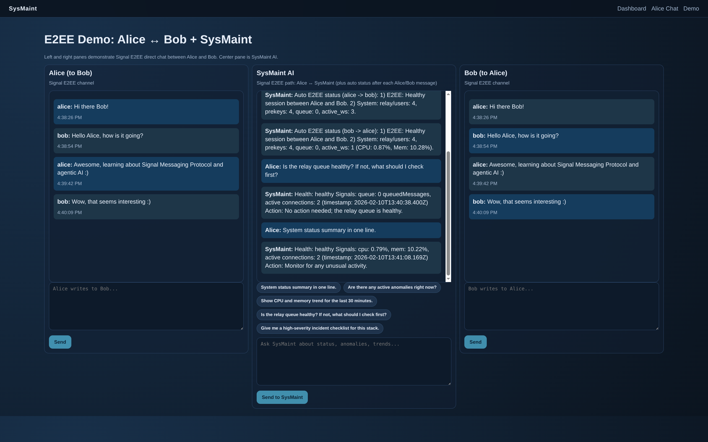

# Signal Protocol E2EE + SysMaint Agentic Operations

[](https://opensource.org/licenses/MIT)

A production-ready demonstration of end-to-end encrypted (E2EE) system maintenance operations using the Signal Protocol, featuring an AI-powered SysMaint agent, real-time telemetry dashboard, and interactive E2EE messaging demos.

## Overview

This repository implements a local-first secure messaging and operations stack combining:

- **End-to-end encrypted messaging** via the official Signal library (`@signalapp/libsignal-client`)
- **AI-powered system monitoring** with LangChain + OpenAI integration
- **Real-time telemetry collection** and visualization dashboard
- **Interactive E2EE demonstrations** showing Signal Protocol in action
- **Zero-trust relay architecture** where the server cannot read message content

The cryptographic primitives and protocol logic come from the official libsignal library. This project does not reimplement Signal cryptography.

## Table of Contents

- [Quick Start](#quick-start)
- [System Architecture](#system-architecture)
- [Data Flows](#data-flows)
- [Component Architecture](#component-architecture)
- [Security Model](#security-model)
- [Technology Stack](#technology-stack)
- [Deployment Architecture](#deployment-architecture)
- [Key Design Decisions](#key-design-decisions)
- [Repository Structure](#repository-structure)
- [Environment Variables](#environment-variables)
- [Build and Run](#build-and-run)
- [API Reference](#api-reference)
- [Troubleshooting](#troubleshooting)
- [Security Notes](#security-notes)
- [License](#license)

## Quick Start

```bash
# 1. Configure environment
cp .env.example .env
# Edit .env and set:
# OPENAI_API_KEY=your_openai_api_key
# MEGA_PASSPHRASE=alpha

# 2. Install dependencies
npm ci
npm run build

# 3. Start full stack
docker compose up -d --build relay sysmaint-agent diag-probe sysmaint-web

# 4. Test the system
curl -sS -X POST http://localhost:3000/api/chat \
  -H 'Content-Type: application/json' \
  -d '{"prompt":"System status summary in one line."}'

# 5. Open the dashboard
open http://localhost:3000
```

**Access Points:**
- Dashboard: http://localhost:3000
- Alice Chat: http://localhost:3000/chat
- E2EE Demo: http://localhost:3000/demo



## System Architecture

```
┌─────────────────────────────────────────────────────────────────────────────┐
│                           CLIENT LAYER                                      │
│  ┌─────────────────┐  ┌─────────────────┐  ┌─────────────────────────────┐ │
│  │   Web Browser   │  │   Web Browser   │  │       SysMaint CLI          │ │
│  │  (Alice User)   │  │   (Bob UI)      │  │    (AI Agent Terminal)      │ │
│  └────────┬────────┘  └────────┬────────┘  └─────────────┬───────────────┘ │
└───────────┼────────────────────┼─────────────────────────┼─────────────────┘
            │                    │                         │
            └────────────────────┼─────────────────────────┘
                                 │
                                 ▼
┌─────────────────────────────────────────────────────────────────────────────┐
│                        APPLICATION LAYER                                    │
│  ┌──────────────────────────────────────────────────────────────────────┐   │
│  │                    Next.js Web Application                            │   │
│  │  ┌──────────────┐  ┌──────────────┐  ┌──────────────────────────┐    │   │
│  │  │  Dashboard   │  │  Chat Page   │  │      Demo Page           │    │   │
│  │  │   (page.tsx) │  │ (chat/page)  │  │   (demo/page.tsx)        │    │   │
│  │  └──────────────┘  └──────────────┘  └──────────────────────────┘    │   │
│  │                                                                       │   │
│  │  ┌─────────────────────────────────────────────────────────────────┐  │   │
│  │  │                     API Routes                                   │  │   │
│  │  │  /api/status/*  │  /api/chat  │  /api/e2ee/send  │  /api/e2ee/pull │   │
│  │  └─────────────────────────────────────────────────────────────────┘  │   │
│  └─────────────────────────────────┬─────────────────────────────────────┘   │
└────────────────────────────────────┼────────────────────────────────────────┘
                                     │
                                     ▼
┌─────────────────────────────────────────────────────────────────────────────┐
│                      SIGNAL PROTOCOL LAYER                                  │
│  ┌─────────────────────┐  ┌─────────────────────┐  ┌─────────────────────┐  │
│  │   signal-core       │  │   @signalapp/       │  │   sysmaint-protocol │  │
│  │   (Crypto + Store)  │  │   libsignal-client  │  │   (Message Types)   │  │
│  └─────────────────────┘  └─────────────────────┘  └─────────────────────┘  │
└─────────────────────────────────────────────────────────────────────────────┘
                                     │
                                     ▼
┌─────────────────────────────────────────────────────────────────────────────┐
│                         RELAY LAYER                                         │
│  ┌───────────────────────────────────────────────────────────────────────┐   │
│  │                         Relay Server                                  │   │
│  │  ┌──────────────┐  ┌──────────────┐  ┌──────────────────────────┐     │   │
│  │  │ HTTP Routes  │  │  WebSocket   │  │   Message Queue          │     │   │
│  │  │  (REST API)  │  │   Server     │  │   (In-Memory Store)      │     │   │
│  │  └──────────────┘  └──────────────┘  └──────────────────────────┘     │   │
│  └───────────────────────────────────────────────────────────────────────┘   │
└─────────────────────────────────────────────────────────────────────────────┘
                                     │
                                     ▼
┌─────────────────────────────────────────────────────────────────────────────┐
│                      TELEMETRY LAYER                                        │
│  ┌─────────────────────┐  ┌─────────────────────┐  ┌─────────────────────┐  │
│  │    diag-probe       │  │   sysmaint-agent    │  │     state-db        │  │
│  │  (Metrics Collector)│  │ (AI + Signal Client)│  │   (SQLite Storage)  │  │
│  └─────────────────────┘  └─────────────────────┘  └─────────────────────┘  │
└─────────────────────────────────────────────────────────────────────────────┘
```

### Component Responsibilities

| Component | Purpose | Technology |
|-----------|---------|------------|
| **Web UI** | User interface for monitoring and chat | Next.js 14, React, TypeScript |
| **Relay Server** | Message routing without content access | Node.js, Express, ws |
| **Signal Core** | Cryptographic operations | @signalapp/libsignal-client |
| **SysMaint Agent** | AI-powered system analysis | LangChain, OpenAI, Signal Protocol |
| **Diag Probe** | System metrics collection | Node.js, systeminformation |
| **State DB** | Telemetry and usage persistence | better-sqlite3 |



## Data Flows

### 1. Alice to SysMaint AI Chat

```
Alice          Web UI           Signal         Relay       SysMaint       OpenAI
  │              │               │              │           Agent          │
  │ Type prompt  │               │              │            │             │
  │─────────────>│               │              │            │             │
  │              │ POST /api/chat│              │            │             │
  │              │──────────────>│ Encrypt msg  │            │             │
  │              │               │─────────────>│            │             │
  │              │               │              │──Encrypted envelope────>│
  │              │               │              │            │ Decrypt     │
  │              │               │              │            │────────────>│
  │              │               │              │            │  Process    │
  │              │               │              │            │  with LLM   │
  │              │               │              │            │<────────────│
  │              │               │              │<─Encrypted reply────────│
  │              │               │<─────────────│            │             │
  │              │<──────────────│ Decrypt      │            │             │
   │<─────────────│ Display reply │              │            │             │
```



### 2. Alice to Bob Direct Messaging (E2EE Demo)

```
Alice's        Web Backend      Relay Server    Web Backend      Bob's
Browser                                          (polling)       Browser
   │                │                │                │             │
   │ Type message   │                │                │             │
   │───────────────>│                │                │             │
   │                │ Encrypt (E2EE)│                │             │
   │                │───────────────>│ Store in queue │            │
   │                │                │                │ Poll every  │
   │                │                │                │ 1.2 seconds │
   │                │                │<───────────────│             │
   │                │                │ Return encrypted│            │
   │                │                │───────────────>│ Decrypt    │
   │                │                │                │────────────>│
   │                │                │                │             │ Display
```

### 3. Telemetry Collection Flow

```
┌─────────────────┐     ┌──────────────┐     ┌──────────────┐     ┌──────────────┐
│  diag-probe     │────>│   Signal     │────>│    Relay     │────>│  Web UI      │
│ (System Stats)  │     │  Encryption  │     │   Server     │     │  Dashboard   │
└─────────────────┘     └──────────────┘     └──────────────┘     └──────────────┘
        │                                                            │
        │ SQLite                                                      │ SQLite
        ▼                                                            ▼
┌─────────────────┐                                           ┌──────────────┐
│   state-db      │                                           │   state-db   │
│ (Local SQLite)  │                                           │ (Web Server) │
└─────────────────┘                                           └──────────────┘
```

## Component Architecture

### Web Application (Next.js)

```
app/
├── layout.tsx              # Root layout with navigation
├── page.tsx                # Dashboard (system status)
├── chat/page.tsx           # Alice <-> SysMaint chat
├── demo/page.tsx           # 3-panel E2EE demo
└── api/
    ├── chat/route.ts       # Signal-encrypted chat API
    ├── e2ee/send/          # Send encrypted messages
    ├── e2ee/pull/          # Retrieve encrypted messages
    └── status/             # Telemetry endpoints

lib/
├── config.ts               # Configuration management
├── signal.ts               # Alice's Signal operations
├── e2ee-chat.ts            # Demo E2EE messaging
└── state-db.ts             # Database access layer
```

### Signal Protocol Stack

```
┌─────────────────────────────────────────────────────────────┐
│                  SIGNAL PROTOCOL STACK                      │
├─────────────────────────────────────────────────────────────┤
│                                                             │
│  ┌─────────────────────────────────────────────────────┐   │
│  │  X3DH (Extended Triple Diffie-Hellman)              │   │
│  │  - Identity keys (long-term)                        │   │
│  │  - Signed prekeys (medium-term)                     │   │
│  │  - One-time prekeys (ephemeral)                     │   │
│  │  - Kyber post-quantum keys (optional)               │   │
│  └─────────────────────────────────────────────────────┘   │
│                         │                                   │
│                         ▼                                   │
│  ┌─────────────────────────────────────────────────────┐   │
│  │  Double Ratchet Algorithm                           │   │
│  │  - Root key chain                                   │   │
│  │  - Sending chain (for outbound)                     │   │
│  │  - Receiving chain (for inbound)                    │   │
│  │  - Per-message key derivation                       │   │
│  └─────────────────────────────────────────────────────┘   │
│                         │                                   │
│                         ▼                                   │
│  ┌─────────────────────────────────────────────────────┐   │
│  │  AES-256-GCM Encryption                             │   │
│  │  - 256-bit keys                                     │   │
│  │  - 96-bit nonce                                     │   │
│  │  - Authentication tag (128-bit)                     │   │
│  └─────────────────────────────────────────────────────┘   │
│                                                             │
└─────────────────────────────────────────────────────────────┘
```

### SysMaint Agent Architecture

```
┌─────────────────────────────────────────┐
│         SysMaint Agent                  │
├─────────────────────────────────────────┤
│                                         │
│  ┌─────────────────────────────────┐   │
│  │   Signal Protocol Client        │   │
│  │   - Identity management         │   │
│  │   - Session handling            │   │
│  │   - Encrypt/decrypt             │   │
│  └─────────────────────────────────┘   │
│                                         │
│  ┌─────────────────────────────────┐   │
│  │   LangChain Agent               │   │
│  │   - Prompt processing           │   │
│  │   - Tool selection              │   │
│  │   - Response generation         │   │
│  └─────────────────────────────────┘   │
│                                         │
│  ┌─────────────────────────────────┐   │
│  │   Tools                         │   │
│  │   - get_current_status          │   │
│  │   - get_recent_status_history   │   │
│  │   - get_anomaly_summary         │   │
│  └─────────────────────────────────┘   │
│                                         │
│  ┌─────────────────────────────────┐   │
│  │   OpenAI Integration            │   │
│  │   - GPT-4/3.5-turbo            │   │
│  │   - Token tracking              │   │
│  │   - Cost estimation             │   │
│  └─────────────────────────────────┘   │
│                                         │
└─────────────────────────────────────────┘
```

## Security Model

### Threat Model

**Assumptions:**

- Relay server is honest but curious (follows protocol but may log metadata)
- Network is untrusted (traffic may be intercepted)
- Web server compromise is possible (attacker may gain access but not user's Signal keys)
- User devices are physically secure

**Threats Mitigated:**

| Threat | Mitigation |
|--------|-----------|
| Eavesdropping | End-to-end encryption via Signal Protocol |
| Message Tampering | Cryptographic authentication (HMAC) |
| Replay Attacks | Unique message IDs and timestamps |
| Forward Secrecy | Double Ratchet key rotation |
| Server Compromise | Server never has plaintext access |
| Quantum Computing | CRYSTALS-Kyber post-quantum prekeys |

### Encryption Layers

```
User Input
       │
       ▼
┌──────────────────────┐
│ Double Ratchet       │
│ - Advance chain key  │
│ - Derive message key │
└──────────┬───────────┘
           │
           ▼
┌──────────────────────┐
│ AES-256-GCM Encrypt  │
│ - Key: message key   │
│ - Nonce: unique      │
│ - Auth tag: 128-bit  │
└──────────┬───────────┘
           │
           ▼
     Ciphertext
           │
           ▼
┌──────────────────────┐
│ Signal Envelope      │
│ - Sender identity    │
│ - Recipient          │
│ - Ciphertext         │
│ - Metadata           │
└──────────┬───────────┘
           │
           ▼
     Network Transport
```

### Key Management

```
┌──────────────────────────────────────────────────────────────┐
│                    KEY HIERARCHY                             │
├──────────────────────────────────────────────────────────────┤
│                                                              │
│  ┌─────────────────┐                                         │
│  │ Master Password │ (User-provided)                         │
│  └────────┬────────┘                                         │
│           │ scrypt (N=2^14, r=8, p=5)                        │
│           ▼                                                  │
│  ┌─────────────────┐                                         │
│  │  32-byte Key    │                                         │
│  └────────┬────────┘                                         │
│           │                                                  │
│           ▼                                                  │
│  ┌─────────────────────────────────────────────────────────┐│
│  │              ENCRYPTED KEY STORE                         ││
│  │  ┌─────────────────────────────────────────────────────┐││
│  │  │ Identity Key Pair (Curve25519 or P-256)             │││
│  │  │ - Public: shared with contacts                      │││
│  │  │ - Private: never leaves device                      │││
│  │  └─────────────────────────────────────────────────────┘││
│  │  ┌─────────────────────────────────────────────────────┐││
│  │  │ Signed Prekey (medium-term)                         │││
│  │  │ - Rotated periodically (e.g., weekly)               │││
│  │  │ - Signed by identity key                            │││
│  │  └─────────────────────────────────────────────────────┘││
│  │  ┌─────────────────────────────────────────────────────┐││
│  │  │ One-Time Prekeys (ephemeral)                        │││
│  │  │ - Consumed on first use                             │││
│  │  │ - Batch generated (e.g., 100 at a time)             │││
│  │  └─────────────────────────────────────────────────────┘││
│  │  ┌─────────────────────────────────────────────────────┐││
│  │  │ Kyber Keys (post-quantum)                           │││
│  │  │ - CRYSTALS-Kyber KEM                                │││
│  │  │ - Encapsulation keys for PQ security                │││
│  │  └─────────────────────────────────────────────────────┘││
│  └─────────────────────────────────────────────────────────┘│
│                                                              │
└──────────────────────────────────────────────────────────────┘
```

## Technology Stack

| Layer | Technology | Purpose |
|-------|-----------|---------|
| **Frontend** | Next.js 14, React, TypeScript | Web UI framework |
| **Styling** | CSS3, globals.css | Component styling |
| **Backend** | Node.js, Express | API server |
| **Real-time** | WebSocket (ws library) | Live message delivery |
| **AI/ML** | LangChain, OpenAI GPT-4/3.5 | Intelligent agent |
| **Cryptography** | @signalapp/libsignal-client | Signal Protocol |
| **Database** | better-sqlite3 | Local data persistence |
| **Validation** | Zod | Runtime type checking |
| **Build** | TypeScript, tsx | Compilation |
| **Deployment** | Docker, Docker Compose | Containerization |
| **Package Mgmt** | npm, Turborepo | Workspace management |

## Deployment Architecture

### Docker Compose Topology

```
┌─────────────────────────────────────────────────────────────┐
│                      HOST NETWORK                           │
│                                                             │
│   ┌──────────┐    ┌──────────┐    ┌──────────┐            │
│   │   User   │    │   User   │    │  SysMaint │            │
│   │ Browser  │    │ Browser  │    │   Agent   │            │
│   └────┬─────┘    └────┬─────┘    └────┬─────┘            │
│        │               │               │                   │
└────────┼───────────────┼───────────────┼───────────────────┘
         │               │               │
         └───────────────┼───────────────┘
                         │
              ┌──────────┴──────────┐
              │    Docker Network   │
              │                     │
              │  ┌───────────────┐  │
              │  │  Relay Server │  │  Port 8080
              │  └───────────────┘  │
              │                     │
              │  ┌───────────────┐  │
              │  │   Web Server  │  │  Port 3000
              │  └───────────────┘  │
              │                     │
              │  ┌───────────────┐  │
              │  │  Diag Probe   │  │
              │  └───────────────┘  │
              └─────────────────────┘
```

### Service Dependencies

```
relay
 ├── sysmaint-agent (depends on relay)
 ├── diag-probe (depends on relay)
 └── sysmaint-web (depends on relay)
```

### Data Persistence

| Service | Storage | Path | Persistence |
|---------|---------|------|-------------|
| Web | SQLite | `/data/state.db` | Docker volume |
| Diag Probe | SQLite | `/data/probe.db` | Docker volume |
| Relay | In-Memory | N/A | Ephemeral (messages) |

## Key Design Decisions

### 1. Server-Side vs Client-Side Encryption

**Decision:** Server-side Signal operations for web demo

**Rationale:**
- Simplifies browser compatibility
- Easier to implement and debug
- Educational clarity

**Trade-off:** Web server has temporary plaintext access (documented limitation)

**Production Alternative:** Client-side encryption with WebAssembly Signal library

### 2. SQLite vs External Database

**Decision:** SQLite for local storage

**Rationale:**
- Zero external dependencies
- Simple deployment
- Sufficient for demo scale
- ACID transactions

**Limitation:** Single-node only (acceptable for demo)

### 3. Polling vs WebSocket for Dashboard

**Decision:** HTTP polling every 5 seconds

**Rationale:**
- Simpler implementation
- Works through proxies/firewalls
- Easier to cache and scale
- Sufficient for monitoring use case

### 4. Signal Protocol Library Choice

**Decision:** Official @signalapp/libsignal-client

**Rationale:**
- Official implementation
- Production-tested cryptography
- Post-quantum support (Kyber)
- Active maintenance

### 5. LangChain vs Direct OpenAI

**Decision:** LangChain for AI agent

**Rationale:**
- Structured tool use
- Memory and context management
- Prompt templates
- Observability hooks
- Easy to extend

### 6. Monorepo Structure

**Decision:** Turborepo with shared packages

**Rationale:**
- Code sharing between apps
- Consistent tooling
- Atomic changes across packages
- Shared TypeScript types

## Repository Structure

```
├── apps/
│   ├── cli/                    # Command-line interface
│   ├── diag-probe/             # System metrics collector
│   ├── sysmaint-agent/         # AI agent service
│   └── sysmaint-web/           # Next.js web application
├── packages/
│   ├── relay-server/           # Message relay service
│   ├── shared/                 # Shared utilities
│   ├── signal-core/            # Signal Protocol implementation
│   └── sysmaint-protocol/      # Message type definitions
├── infra/
│   ├── docker/                 # Docker configurations
│   └── diagnostics/            # Diagnostic tools
├── scripts/                    # Utility scripts
├── docker-compose.yml          # Service orchestration
├── package.json                # Workspace configuration
└── README.md                   # This file
```

## Environment Variables

### Global
- `MEGA_PASSPHRASE` - Passphrase for encrypted Signal stores (required)

### Relay
- `RELAY_PORT` - HTTP port (default: 8080)
- `RELAY_DB` - SQLite database path

### SysMaint Agent
- `OPENAI_API_KEY` - OpenAI API key (required)
- `OPENAI_MODEL` - Model name (default: gpt-4o-mini)
- `OPENAI_INPUT_USD_PER_1M` - Input token cost (default: 0.15)
- `OPENAI_OUTPUT_USD_PER_1M` - Output token cost (default: 0.60)
- `SYSMAINT_ID` - Agent identity (default: sysmaint)

### Diag Probe
- `DIAG_PROBE_ID` - Probe identity (default: diagprobe)
- `SYSMAINT_PROBE_INTERVAL_MS` - Collection interval (default: 10000)

### Web
- `ALICE_ID` - Alice identity (default: alice)
- `BOB_ID` - Bob identity (default: bob)
- `SYSMAINT_CHAT_TIMEOUT_MS` - Chat timeout (default: 25000)

## Build and Run

### Prerequisites
- Node.js >= 24
- Docker Engine + Docker Compose

### Installation

```bash
# Install dependencies
npm ci

# Build workspace packages
npm run build
```

### Development Mode

```bash
# Terminal 1: Start relay
npm run dev:relay

# Terminal 2: Start agent
npm run sysmaint:agent

# Terminal 3: Start probe
npm run sysmaint:probe

# Terminal 4: Start web
npm run sysmaint:web:dev
```

### Docker Deployment

```bash
# Configure environment
cp .env.example .env
# Edit .env with your OPENAI_API_KEY

# Start all services
docker compose up -d --build

# Check status
docker compose ps

# View logs
docker compose logs -f

# Stop
docker compose down
```

### Health Checks

```bash
# Relay health
curl http://localhost:8080/health

# Relay diagnostics
curl http://localhost:8080/diagnostics

# Dashboard status
curl http://localhost:3000/api/status/current

# Test chat
curl -X POST http://localhost:3000/api/chat \
  -H 'Content-Type: application/json' \
  -d '{"prompt":"System status summary"}'
```

## API Reference

### Relay Endpoints

| Endpoint | Method | Description |
|----------|--------|-------------|
| `/health` | GET | Health check |
| `/diagnostics` | GET | System diagnostics |
| `/v1/register` | POST | Register identity |
| `/v1/prekeys` | POST | Upload prekey bundle |
| `/v1/prekeys/:id` | GET | Fetch prekey bundle |
| `/v1/messages` | POST | Send message |
| `/ws?client_id=:id` | WS | WebSocket connection |

### Web API Endpoints

| Endpoint | Method | Description |
|----------|--------|-------------|
| `/api/chat` | POST | Alice -> SysMaint chat |
| `/api/e2ee/send` | POST | Send direct E2EE message |
| `/api/e2ee/pull` | GET | Pull direct messages |
| `/api/status/current` | GET | Current system status |
| `/api/status/history` | GET | Status history |
| `/api/status/usage/reset` | POST | Reset usage counters |

## Troubleshooting

### Module Not Found Errors

**Cause:** Workspace packages not built

**Fix:**
```bash
npm ci
npm run build
docker compose up -d --build
```

### Chat Timeout

**Check logs:**
```bash
docker compose logs --tail=200 sysmaint-agent sysmaint-web relay
```

**Common causes:**
- Missing/invalid `OPENAI_API_KEY`
- Stale Signal DB state
- Concurrent listeners on same identity

**Reset:**
```bash
docker compose down --remove-orphans
docker compose up -d --build relay sysmaint-agent diag-probe sysmaint-web
```

### PreKey Not Found

Usually identity/session state drift. Reinitialize:
```bash
rm -rf data/*.db
docker compose up -d --build
```

## Security Notes

This project is designed for local development and protocol experimentation. Before production use:

- Implement authenticated relay clients and access control
- Enable TLS termination and certificate management
- Add envelope-level replay protection and audit trails
- Define prekey rotation strategy and multi-device handling
- Use proper secrets management (not .env files)
- Deploy centralized observability and alerting
- Implement DoS/rate-limit controls on relay endpoints
- Consider client-side encryption for true E2EE

## Performance Characteristics

| Operation | Typical Latency |
|-----------|----------------|
| Dashboard refresh | ~50ms |
| Signal encryption | 5-10ms |
| Session establishment | 50-100ms |
| AI response (GPT-4) | 2-5s |
| Message delivery | <100ms |

## License

This project is licensed under the MIT License - see the [LICENSE](LICENSE) file for details.

Copyright (c) 2026 Signal Protocol E2EE + SysMaint Agentic Operations Contributors

---

**Note:** Signal Protocol is © Signal Messenger, LLC. This project uses the official @signalapp/libsignal-client library under its respective license.
